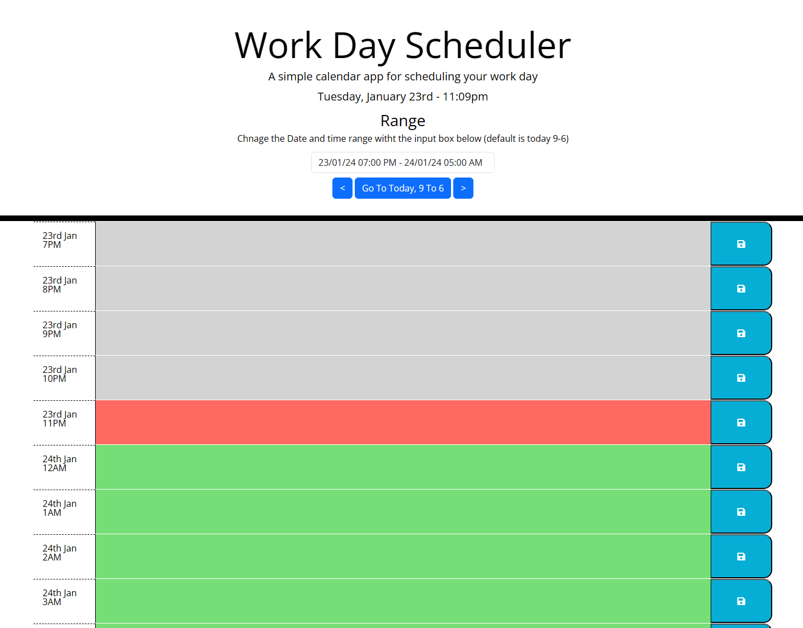

# Hourly-JS 📅
## You Days, scheduled!

## Description
This dynamic scheduler features multi day, hour by hour planning - allowing you to plan in advance and view previous days' tasks. Hourly-JS also allows you to view and add tasks using a custom date and time range. All your scheduled tasks are stored in local storage so it's persistent when you refresh the page and your schedule is private, only you can see it! 👀🔐

The motivation behind creating Hourly-JS was that it became difficult to plan my day efficiently and stick to the day-plan so, I created a solution. My solution was to develop a custom web app which would allow me to keep track of my tasks hour-by-hour, day-by-day... That's when Hourly-JS was born!

Please see a full list of features [here](#Features)

## Table of Contents

- [Dev Requirements](#Dev-Requirements)
- [Dev Environment Setup](#Dev-Environment-Setup)
- [Enduser usage instructions](#End-user-usage-instructions)
- [Features](#Features)
- [How to contribute](#How-to-contribute)
- [technologies ](#technologies)
- [Screenshot](#Screenshot)
- [Credits](#credits)
- [License](#license)

## Dev Requirements
Git/GitBash, VS Code, and the source code, of course! 🛠️

## Dev Environment Setup
To get the development environment running:
1. Clone this repo
2. Open the repo folder in VS Code
3. Right-click on `index.html` and open it using the default browser.

- `index.html`: Contains all HTML code for the scheduler
- `assets/js/`: Contains all javaScript for the webapp
- `assets/css/`: Contains all CSS styling for the webapp
- `assets/images/`: Contains all images used in the webpage

## Enduser usage instructions
There is no special requirements for end users. Simply visit [here](https://rossne99.github.io/Hourly-JS/) And start scheduling !

## Features
- **Allows you to plan tasks for today and in advance**
- **multi day, hour by hour planning**
- **Is color coded so you know if your looking at the past, present or future**
- **All data is stored on your local pc so it is sercure, private and persistent**

## How to contribute
1. Fork this repository
2. Clone the repository
3. Create a branch for your bug fix or feature
4. Make necessary changes and commit those changes
5. Push changes to GitHub
6. Create a pull request to this repo to submit your changes for review

## Technologies
- **JavaScript**
- **HTML**
- **CSS**
- **Jquery**
- **DayJS**

## Screenshot

The following image shows the web application's appearance and functionality:

> **Note**: This is the main page of the scheduler.

## Credits 
- **Ross** - Source Code

---

## Licence

MIT License

Copyright (c) 2023 RossNE99

Permission is hereby granted, free of charge, to any person obtaining a copy
of this software and associated documentation files (the "Software"), to deal
in the Software without restriction, including without limitation the rights
to use, copy, modify, merge, publish, distribute, sublicense, and/or sell
copies of the Software, and to permit persons to whom the Software is
furnished to do so, subject to the following conditions:

The above copyright notice and this permission notice shall be included in all
copies or substantial portions of the Software.

THE SOFTWARE IS PROVIDED "AS IS", WITHOUT WARRANTY OF ANY KIND, EXPRESS OR
IMPLIED, INCLUDING BUT NOT LIMITED TO THE WARRANTIES OF MERCHANTABILITY,
FITNESS FOR A PARTICULAR PURPOSE AND NONINFRINGEMENT. IN NO EVENT SHALL THE
AUTHORS OR COPYRIGHT HOLDERS BE LIABLE FOR ANY CLAIM, DAMAGES OR OTHER
LIABILITY, WHETHER IN AN ACTION OF CONTRACT, TORT OR OTHERWISE, ARISING FROM,
OUT OF OR IN CONNECTION WITH THE SOFTWARE OR THE USE OR OTHER DEALINGS IN THE
SOFTWARE.